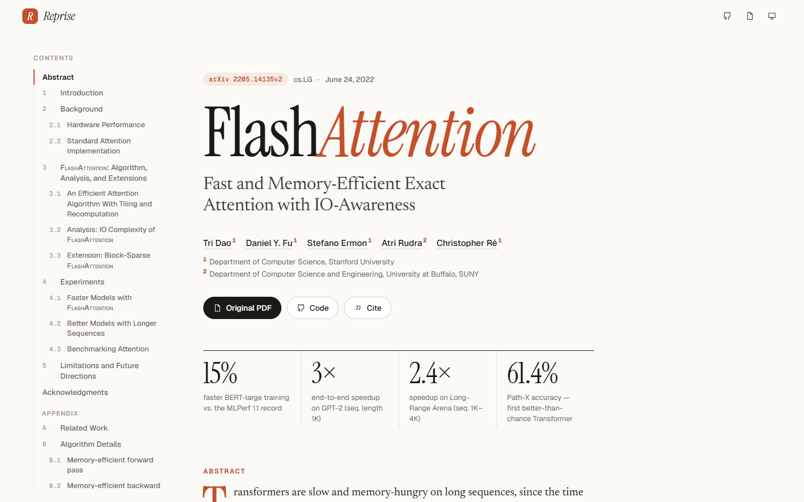
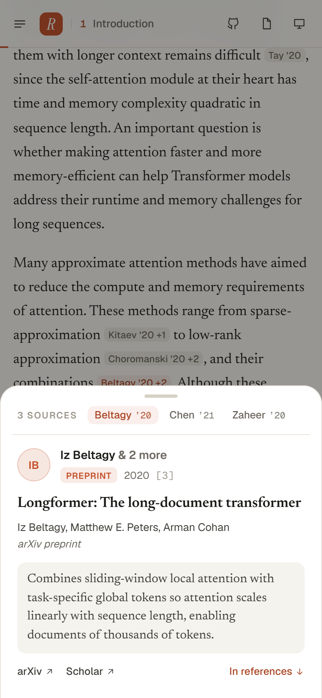
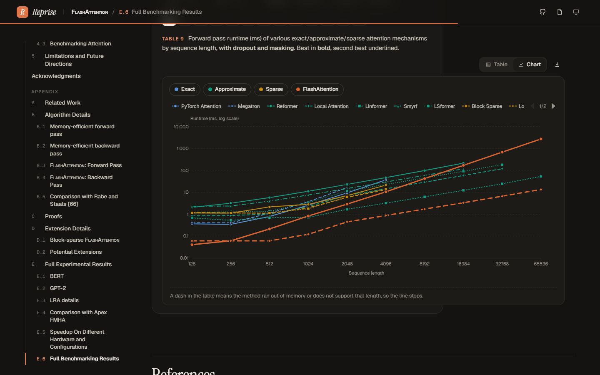

# Reprise — research papers, reborn



| Citation peek on mobile | Benchmarks as charts (dark) |
|---|---|
|  |  |

A Vite + React reader that renders a research paper from **JSON documents at runtime**
(server-driven UI): the app fetches `paper.json` + `references.json` and a block
registry maps each block's `type` to a component. The first paper converted is
*FlashAttention* (arXiv 2205.14135v2).

```bash
npm install
npm run dev        # compiles content → public/papers/*/ then starts Vite
npm run build      # same, then a production build in dist/
```

**Deploying (e.g. Cloudflare Pages):** build command `npm run build`, output directory `dist`.

## How it's put together

```
content/
  flashattention.mjs        ← the paper, authored as block objects (source of truth)
  references.json           ← bibliography, isolated into a schema (94 entries)
  benchmark-tables.json     ← Tables 9–21, extracted from the PDF by word coordinates
scripts/build-paper.mjs     ← validates + compiles content into runtime JSON
public/papers/<id>/         ← paper.json, references.json, figures/*.png (what the app fetches)
src/
  components/Blocks.jsx     ← block registry (heading, paragraph, equation, algorithm, …)
  components/Inline.jsx     ← inline markup → math, citation chips, cross-refs, sidenotes
  components/DataTable.jsx  ← table ↔ chart toggle, best/second-best marks, CSV export
  lib/charts.js             ← declarative chart specs → ECharts options (theme-aware)
```

`build-paper.mjs` fails the build if any citation, cross-reference, footnote or image
is missing, or if **any LaTeX fails to parse in KaTeX** — so a converted paper can't
ship with broken math.

## Block types

| `type` | Fields |
|---|---|
| `heading` | `level` (1–2), `number`, `title`, `id` |
| `paragraph` | `text`, optional `lead` (run-in heading like “Tiling.”) |
| `list` | `ordered`, `items: [{ lead?, text }]` |
| `equation` | `tex` (display math), optional `id`, `number`, `label` — rendered as a code-block card with TeX view + copy |
| `algorithm` | `id`, `number`, `title`, `require: [text]`, `lines: [{ indent, text }]` |
| `theorem` | `kind` (Theorem/Proposition), `number`, `id`, `text` |
| `proof` | `of`, `id`, `blocks: [...]` (collapsible) |
| `figure` | `id`, `number`, `caption`, `images: [{ src, alt }]` or mixed `panels`, `wide` |
| `table` | `id`, `number`, `caption`, `columns`, `rows`, optional `highlight`, `chart` |
| `table-set` | faceted group of tables (used for Tables 9–21) |

### Inline markup (any `text`, `caption`, cell)

| Markup | Renders as |
|---|---|
| `$…$` | inline KaTeX (display math is always its own `equation` block) |
| `[@3, 9, 92]` | quiet author–year chip; hover/tap → reference peek card |
| `[#fig1:Figure 1]` | cross-reference with a hover preview; click jumps and highlights |
| `[^1]` | footnote → margin sidenote on desktop, tap-to-expand on phones |
| `[label](https://…)`, `**bold**`, `*italic*` | the obvious |

### Table → chart specs

`chart.mode` is one of `rows-as-series` (line or scatter over column headers),
`columns-as-series` (x from a column, series from a row-label pattern, with a metric
switcher), `points` (labelled scatter of two columns) or `error-dots` (mean ± s.d.).
Options include `logY`, `normalizeTo`, `referenceLine`, `familyFilter`, and
`encode.color`/`encode.dash` rules. Series colours come from CSS tokens
(`--series-1…6`), validated for colour-vision deficiency and contrast in both themes.

## Converting the next paper

1. Extract text/figures (PyMuPDF), tables by word coordinates.
2. Author `content/<paper>.mjs` with the block helpers; put LaTeX in `String.raw` strings.
3. Put the bibliography in `content/references.json` (`id, authors[], title, venue, year, kind, arxiv?, doi?, url?, summary`).
4. `npm run build:paper` until it reports ✓.

## Editorial notes for this paper

- Reference **summaries** in the hover cards are editorial additions, not text from the PDF.
- Obvious bibliography typos were normalised (e.g. duplicated author in [71], “Pavlick Ellie” → “Ellie Pavlick”).
- In the PDF the bibliography sits between the acknowledgments and the appendices; here it is moved to the end, with a marker at its original position.
- `\textsc{mask}` is written as `\operatorname{MASK}` (KaTeX has no `\textsc`).
- Figures 1–4 are 300-dpi crops of the PDF's vector art; Figures 5–8 are the embedded images. The bar charts in Figures 5–8 are images only: their exact values aren't in the paper, so they aren't re-plotted.

## License

The code in this repository is MIT-licensed (see [LICENSE](LICENSE)). The paper's text,
equations, tables and figures belong to their authors (Dao, Fu, Ermon, Rudra, Ré —
[arXiv:2205.14135](https://arxiv.org/abs/2205.14135)) and are reproduced here for
demonstration only. `scripts/extract_pdf.py` regenerates the figures and benchmark
tables from the arXiv PDF, which isn't committed.
